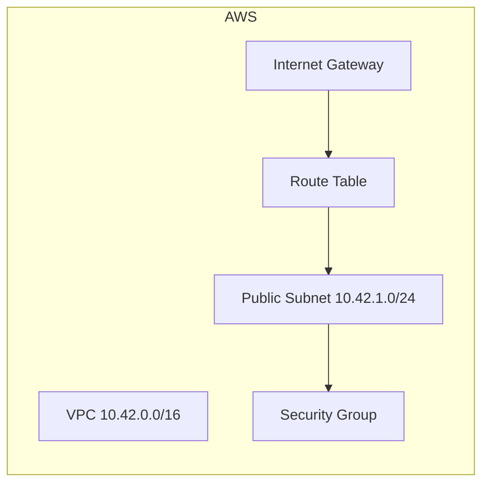

# Networking Module 🌐

## At a Glance
This module builds a lightweight AWS network so your workloads land in a secure, internet-connected sandbox without manual wiring.

## What Gets Created
- **VPC**: opinionated CIDR block with DNS features enabled for smooth service discovery.
- **Public Subnet**: auto-assigns public IPs to instances so they can reach the internet.
- **Security Group**: ingress/egress rules sourced from `basic_sg_config` for quick hardening.
- **Internet Gateway + Route Table**: pipes outbound traffic through a default 0.0.0.0/0 route.

## Customize in Seconds ⚙️
| Input | Purpose |
| --- | --- |
| `main_config.tags` | Stamps resources for cost allocation and discovery. |
| `basic_sg_config.ingress` | Controls inbound port/protocol/CIDR combos. |
| `basic_sg_config.egress` | Defines outbound access (defaults to open). |
| `basic_internet_config.router.internet_route_cidr` | Tweaks the default route destination. |

## Workflow 🚀
1. **Set inputs** in `terraform.tfvars` to match your CIDR and open ports.
2. **Initialize** providers with `terraform init`.
3. **Preview** using `terraform plan` to confirm route tables and security rules.
4. **Apply** with `terraform apply` to spin up the network backbone.
5. **Attach workloads** (Lambda, EC2, etc.) using the exported subnet and security group IDs.

## Outputs 📦
- `vpc_id`
- `subnet_id`
- `security_group_id`

Leverage these outputs to snap additional modules into the same network without rework. 🎯
